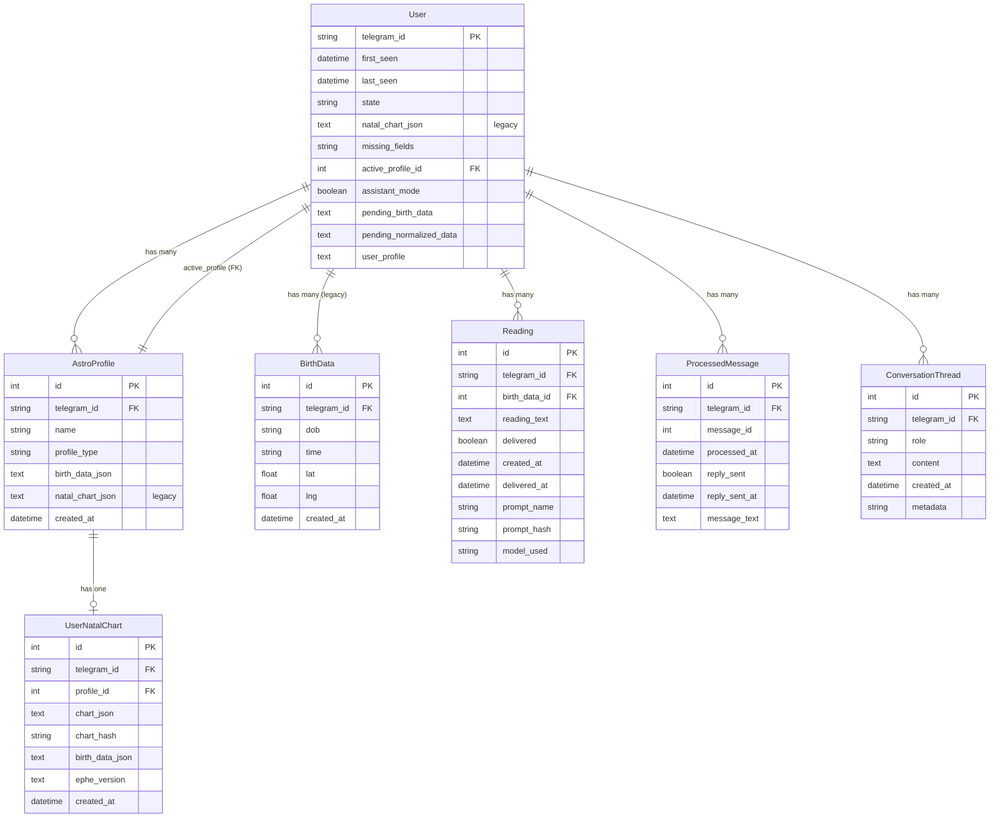

# Product Analyst Flow Visualizations

This document contains comprehensive flow diagrams and visualizations for understanding the natal_nataly Telegram bot system.

## Table of Contents

1. [System Architecture](#1-system-architecture)
2. [User Journey Flows](#2-user-journey-flows)
3. [Data Flow & Processing Pipeline](#3-data-flow--processing-pipeline)
4. [State Management](#4-state-management)
5. [Sequence Diagrams](#5-sequence-diagrams)
6. [Database Schema](#6-database-schema)
7. [Deployment Architecture](#7-deployment-architecture)

---

## 1. System Architecture

High-level overview of the system components and their interactions.


### Component Responsibilities

- **Webhook Endpoint**: Receives and validates Telegram updates
- **Bot Logic**: Orchestrates message handling and response generation
- **Intent Router**: Classifies user intent and routes to appropriate handler
- **Chart Builder**: Generates natal chart representations
- **Date Parser**: Extracts and normalizes birth data from natural language
- **Transit Builder**: Calculates and formats transit positions
- **LLM Integration**: Manages all LLM API calls and prompt handling
- **Astrology Engine**: Wraps Swiss Ephemeris for astronomical calculations
- **Database**: Persistent storage for users, profiles, charts, and readings
- **Message Cache**: Deduplication and throttling of webhook messages
- **Thread Manager**: Maintains conversation context and history
- **User Commands**: Handles special commands (/my_data, /profiles, etc.)

---

## 2. User Journey Flows

### 2.1 First-Time User Journey


### 2.2 Returning User Journey (Assistant Mode)


### 2.3 Multi-Profile Management Flow


---

## 3. Data Flow & Processing Pipeline

### 3.1 Message Processing Pipeline


### 3.2 Birth Data Extraction Flow


### 3.3 Chart Generation Flow


---

## 4. State Management

### 4.1 User State Transitions


### 4.2 Message Processing State Machine


---

## 5. Sequence Diagrams

### 5.1 First-Time User: Birth Data Extraction


### 5.2 Chart Generation & First Reading


### 5.3 Assistant Conversation with Context


### 5.4 Message Throttling & Combining


---

## 6. Database Schema

### 6.1 Entity Relationship Diagram



### 6.2 Key Database Patterns

**Multi-Profile Architecture:**
- Each `User` can have multiple `AstroProfile` records (self, partner, friends)
- `active_profile_id` points to the currently selected profile
- Each `AstroProfile` can have one `UserNatalChart` with versioned data

**Message Deduplication:**
- `ProcessedMessage` stores every webhook message
- Unique constraint on `(telegram_id, message_id)` prevents duplicates
- `reply_sent` flag enables throttling logic

**Conversation Context:**
- `ConversationThread` stores Q&A pairs with timestamps
- Enables context-aware assistant responses
- Limited to recent messages (e.g., last 10) to manage token usage

**Reading Reproducibility:**
- `Reading` table tracks which prompt template and model were used
- `prompt_hash` enables detection of prompt changes
- Allows re-generating readings with updated prompts

---

## 7. Deployment Architecture

### 7.1 Local Development


### 7.2 Production Deployment (Render)


### 7.3 Data Flow: Development vs Production


**Key Differences:**

| Aspect | Development | Production |
|--------|-------------|------------|
| Database | SQLite (file-based) | PostgreSQL (managed) |
| HTTPS | ngrok tunnel | Native HTTPS via Render |
| Scalability | Single instance | Auto-scaling capable |
| Persistence | Local file system | Cloud volumes + managed DB |
| Logs | Console output | Render log streaming |
| Env Config | .env file | Render dashboard |

---

## 8. Key Metrics & Analytics Points

For product analysts tracking the system, here are the key metrics available:

### 8.1 User Metrics

```sql
-- Total users
SELECT COUNT(*) FROM users;

-- Users by state
SELECT state, COUNT(*) as count 
FROM users 
GROUP BY state;

-- Active users (last 7 days)
SELECT COUNT(*) FROM users 
WHERE last_seen > NOW() - INTERVAL '7 days';

-- Users with multiple profiles
SELECT COUNT(*) FROM (
  SELECT telegram_id 
  FROM astro_profiles 
  GROUP BY telegram_id 
  HAVING COUNT(*) > 1
) multi_profile_users;
```

### 8.2 Engagement Metrics

```sql
-- Total readings generated
SELECT COUNT(*) FROM readings;

-- Readings per user (distribution)
SELECT telegram_id, COUNT(*) as reading_count 
FROM readings 
GROUP BY telegram_id 
ORDER BY reading_count DESC;

-- Conversation thread depth
SELECT AVG(message_count) as avg_thread_depth
FROM (
  SELECT telegram_id, COUNT(*) as message_count
  FROM conversation_threads
  GROUP BY telegram_id
) threads;

-- Messages processed per day
SELECT DATE(processed_at) as date, COUNT(*) as messages
FROM processed_messages
GROUP BY DATE(processed_at)
ORDER BY date DESC
LIMIT 30;
```

### 8.3 Performance Metrics

```sql
-- Duplicate/throttled message rate
SELECT 
  COUNT(*) as total_messages,
  COUNT(CASE WHEN reply_sent = FALSE THEN 1 END) as throttled
FROM processed_messages;

-- Average time to first chart (user onboarding)
SELECT AVG(
  EXTRACT(EPOCH FROM (created_at - first_seen))
) / 60 as avg_minutes_to_chart
FROM users u
JOIN user_natal_charts c ON u.telegram_id = c.telegram_id
WHERE u.state = 'has_chart';
```

### 8.4 Feature Usage

```sql
-- Command usage (from processed_messages)
SELECT 
  CASE 
    WHEN message_text LIKE '/my_data%' THEN 'my_data'
    WHEN message_text LIKE '/profiles%' THEN 'profiles'
    WHEN message_text LIKE '/my_chart_raw%' THEN 'chart_raw'
    WHEN message_text LIKE '/edit_birth%' THEN 'edit_birth'
    ELSE 'conversation'
  END as command_type,
  COUNT(*) as usage_count
FROM processed_messages
WHERE message_text IS NOT NULL
GROUP BY command_type
ORDER BY usage_count DESC;

-- Profile types distribution
SELECT profile_type, COUNT(*) as count
FROM astro_profiles
GROUP BY profile_type;
```

---

## Summary

This document provides comprehensive visualizations for understanding:

1. **System Architecture**: How components interact and communicate
2. **User Journeys**: Step-by-step flows for different user scenarios  
3. **Data Processing**: How messages flow through the system
4. **State Management**: How user states transition based on actions
5. **Sequence Diagrams**: Detailed interaction patterns for key features
6. **Database Schema**: Data model and relationships
7. **Deployment**: Development vs production architecture
8. **Analytics**: Key metrics and queries for product analysis

All diagrams use Mermaid format for easy rendering in GitHub and other Markdown viewers.

For implementation details, see:
- [PROJECT_STRUCTURE.md](PROJECT_STRUCTURE.md) - Codebase organization
- [SETUP.md](SETUP.md) - Local development setup
- [guides/STATEFUL_BOT_GUIDE.md](guides/STATEFUL_BOT_GUIDE.md) - State management details
- [guides/CONVERSATION_THREAD_GUIDE.md](guides/CONVERSATION_THREAD_GUIDE.md) - Thread management
